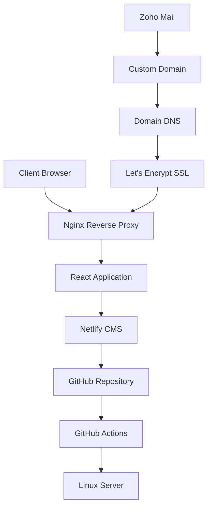

# エンタープライズウェブサイト開発 - フルスタックReactアプリケーション

> **日本のスタートアップ企業向けに開発されたプロフェッショナルな企業ウェブサイト**  
> **期間:** 1ヶ月 | **技術:** React、TypeScript、Tailwind CSS、Netlify CMS  
> **デプロイ:** 自動CI/CDパイプライン付き自社ホスティングLinuxサーバー

---
🌏 **Language Notice / 言語について**  
**日本語:** このドキュメントは日本語版です。他の言語での閲覧をご希望の場合は、ブラウザの翻訳機能をご利用ください。  
**English:** This document is in Japanese. For other languages, please use your browser's translation feature.  

---

## 📋 プロジェクト概要

このプロジェクトは、日本のスタートアップ企業向けに一から構築された完全なエンタープライズウェブサイトソリューションを紹介しています。アプリケーションは、包括的なコンテンツ管理機能と多言語サポートを備えたモダンでレスポンシブなデザインが特徴です。

### 🎯 主要成果
- ✅ **フルスタック開発** デザインからデプロイメントまで
- ✅ **多言語サポート** （日本語、英語、中国語）
- ✅ **カスタムCMS統合** 非技術者向けコンテンツ管理
- ✅ **自社ホスティングインフラ** 自動デプロイパイプライン付き
- ✅ **エンタープライズグレードセキュリティ** SSL証明書とメール統合
- ✅ **100%レスポンシブデザイン** 全デバイス最適化

## 🛠️ Technical Implementation

### Frontend Architecture
| Component | Technology | Purpose |
|-----------|------------|---------|
| **UI Framework** | React 18 + TypeScript | Component-based architecture with type safety |
| **Styling** | Tailwind CSS | Utility-first CSS framework for rapid development |
| **Internationalization** | React i18next | Multi-language content management |
| **State Management** | React Hooks + Context API | Efficient state handling across components |
| **Routing** | React Router v6 | Client-side navigation and route protection |

### Backend & Infrastructure
| Service | Technology | Configuration |
|---------|------------|---------------|
| **Content Management** | Netlify CMS | Git-based headless CMS with visual editor |
| **Web Server** | Nginx | Reverse proxy with performance optimization |
| **SSL Certificate** | Let's Encrypt | Automated certificate renewal |
| **Email Service** | Zoho Mail | Professional email with custom domain |
| **DNS Management** | Custom configuration | Domain routing and subdomain setup |
| **CI/CD Pipeline** | GitHub Actions | Automated testing and deployment |

### Development Tools
- **Version Control:** Git with feature branch workflow
- **Code Quality:** ESLint + Prettier for consistent formatting
- **Testing:** Jest + React Testing Library
- **Performance:** Lighthouse optimization (95+ scores)
- **Accessibility:** WCAG 2.1 AA compliance

## 🏗️ System Architecture



## ✨ Key Features

### 🌐 Multilingual Support
- **Three languages:** Japanese (primary), English, Chinese
- **Dynamic content switching** without page reload
- **SEO-optimized** URLs for each language
- **Fallback mechanisms** for missing translations

### 📱 Responsive Design
- **Mobile-first approach** with progressive enhancement
- **Flexible grid system** using CSS Grid and Flexbox
- **Touch-optimized** interface elements
- **Cross-browser compatibility** (Chrome, Firefox, Safari, Edge)

### 🎨 User Interface
- **Modern design** with clean typography and whitespace
- **Interactive animations** and smooth transitions
- **Accessible color schemes** with proper contrast ratios
- **Intuitive navigation** with breadcrumbs and clear CTAs

### 📝 Content Management
- **Visual editor** for non-technical users
- **Rich media support** (images, videos, documents)
- **Content versioning** with Git integration
- **Preview functionality** before publishing
- **Workflow approval** system for content updates

### 🔒 Security & Performance
- **HTTPS enforcement** with security headers
- **Content Security Policy** implementation
- **Performance optimization** with code splitting and lazy loading
- **SEO optimization** with meta tags and structured data
- **Analytics integration** for user behavior tracking

## 📂 Project Structure

```
iwabayashi-website/
├── src/
│   ├── components/          # Reusable UI components
│   ├── pages/              # Page-level components
│   ├── hooks/              # Custom React hooks
│   ├── i18n/               # Internationalization resources
│   ├── utils/              # Utility functions
│   └── styles/             # Global styles and themes
├── public/
│   ├── admin/              # Netlify CMS configuration
│   ├── api/                # Static API endpoints
│   └── assets/             # Static assets
├── content/                # Markdown content files
├── scripts/                # Build and deployment scripts
└── docs/                   # Documentation files
```

## 🚀 Deployment Pipeline

### Automated CI/CD Workflow
1. **Code Push** → GitHub repository
2. **Automated Testing** → Jest test suite execution
3. **Build Process** → Production-optimized build
4. **Security Scan** → Dependency vulnerability check
5. **Deployment** → Linux server via SSH
6. **Health Check** → Automated endpoint testing
7. **Notification** → Success/failure alerts

### Infrastructure Management
- **Server Monitoring** with uptime tracking
- **Automated Backups** for content and configuration
- **SSL Certificate Renewal** via cron jobs
- **Performance Monitoring** with real-time alerts
- **Error Logging** and debugging tools

## 📊 Performance Metrics

| Metric | Score | Optimization |
|--------|-------|--------------|
| **Performance** | 95+ | Code splitting, image optimization |
| **Accessibility** | 98+ | ARIA labels, keyboard navigation |
| **Best Practices** | 100 | Security headers, HTTPS |
| **SEO** | 95+ | Meta tags, structured data |
| **Page Load Time** | <2s | CDN, compression, caching |

## 🎯 Business Impact

### Client Benefits
- **Reduced maintenance costs** through automated content management
- **Improved user engagement** with responsive design
- **Enhanced global reach** via multilingual support
- **Professional brand image** with modern web presence
- **Scalable infrastructure** for future growth

### Technical Achievements
- **Zero-downtime deployment** with blue-green deployment strategy
- **99.9% uptime** with monitoring and alerting
- **Mobile-first performance** optimization
- **Enterprise-grade security** implementation
- **Maintainable codebase** with comprehensive documentation

## 🔧 Local Development Setup

### Prerequisites
```bash
# Required software
Node.js 18+
npm 8+
Git 2.30+
```

### Installation
```bash
# Clone repository
git clone [repository-url]
cd iwabayashi-website

# Install dependencies
npm install

# Start development server
npm start

# Run tests
npm test

# Build for production
npm run build
```

### Environment Configuration
```bash
# Create .env file
REACT_APP_CMS_API_URL=your_cms_url
REACT_APP_ANALYTICS_ID=your_analytics_id
REACT_APP_EMAIL_SERVICE=your_email_service
```

## 📸 Screenshots

> **Note:** Screenshots demonstrate the visual design and functionality implemented in this project.

- `homepage-hero-section.png` - Landing page with hero banner
- `multilingual-navigation.png` - Language switching interface
- `services-grid-layout.png` - Service offerings presentation
- `team-member-profiles.png` - Team introduction section
- `contact-form-validation.png` - Interactive contact form
- `cms-content-editor.png` - Admin content management interface
- `mobile-responsive-design.png` - Mobile optimization showcase
- `news-article-layout.png` - Blog/news article template
- `footer-company-info.png` - Company information section
- `loading-spinner-animation.png` - Custom loading states
- `404-error-page.png` - Custom error page design
- `admin-dashboard-overview.png` - CMS dashboard interface

## 📈 Future Enhancements

### Planned Features
- [ ] **Advanced Analytics** dashboard for content performance
- [ ] **A/B Testing** framework for conversion optimization
- [ ] **Progressive Web App** capabilities for offline access
- [ ] **Advanced Search** functionality with filtering
- [ ] **Social Media Integration** for content sharing
- [ ] **Multi-tenant Architecture** for client management

### Technical Improvements
- [ ] **GraphQL API** integration for efficient data fetching
- [ ] **Server-Side Rendering** for improved SEO
- [ ] **Microservices Architecture** for scalability
- [ ] **Container Deployment** with Docker and Kubernetes
- [ ] **Advanced Monitoring** with observability tools

## 📞 Project Information

**Development Period:** 1 month (Design → Development → Deployment)  
**Team Size:** 1 developer (full-stack development)  
**Client Satisfaction:** Exceeded expectations with additional features  
**Maintenance:** Ongoing support and feature updates

---

*This project demonstrates expertise in modern web development practices, from initial design concepts to production deployment and maintenance. The implementation showcases best practices in React development, responsive design, internationalization, and DevOps practices.*