# System Architecture Documentation

## 🏗️ Overall System Design

This document outlines the comprehensive architecture of the enterprise website solution, covering frontend components, backend services, infrastructure, and deployment pipelines.

## 📐 High-Level Architecture

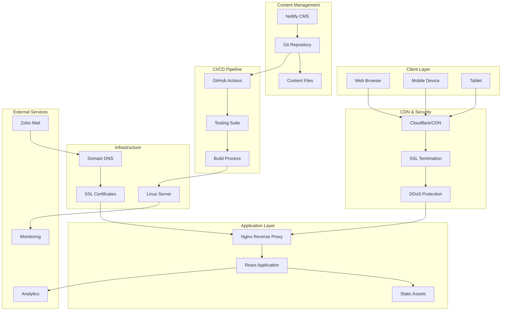

## 🖥️ Frontend Architecture

### Component Hierarchy

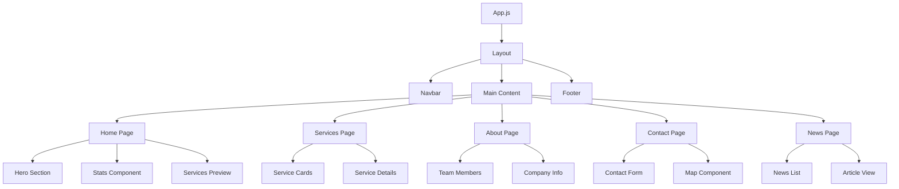

### State Management Flow

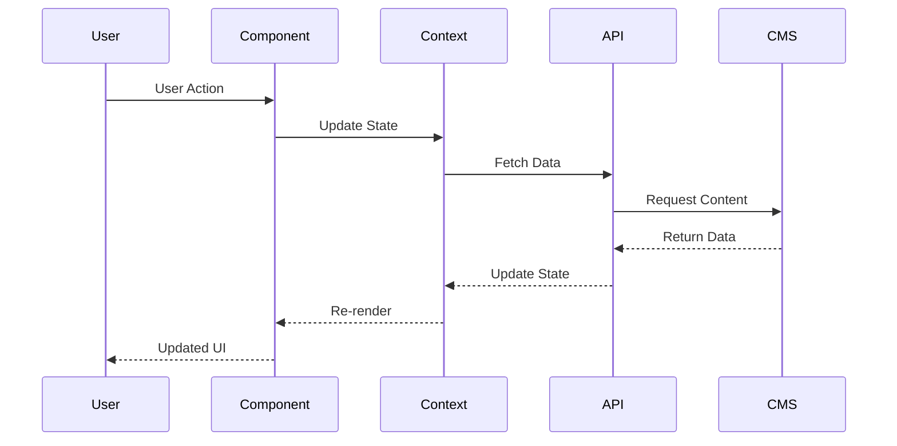

## 🌐 Internationalization Architecture

### Language Resolution Flow

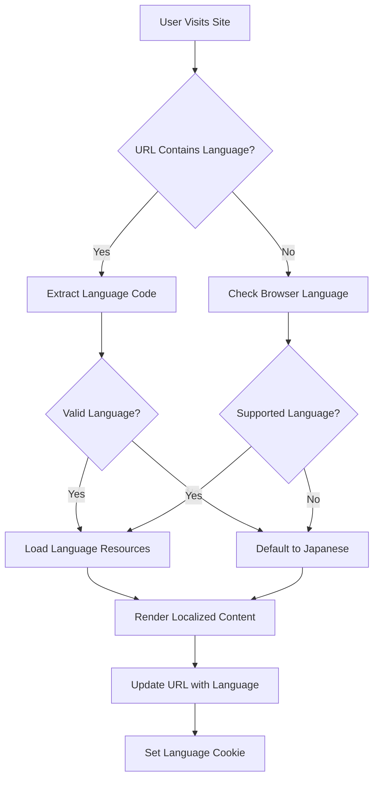

### Content Structure

```
content/
├── pages/
│   ├── home-content.ja.md
│   ├── home-content.en.md
│   └── home-content.zh.md
├── services/
│   ├── export-business.ja.md
│   ├── export-business.en.md
│   └── export-business.zh.md
└── team/
    ├── member-1.ja.md
    ├── member-1.en.md
    └── member-1.zh.md
```

## 🔧 Content Management System

### CMS Data Flow

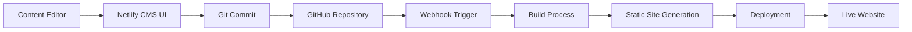

### Content Publishing Workflow

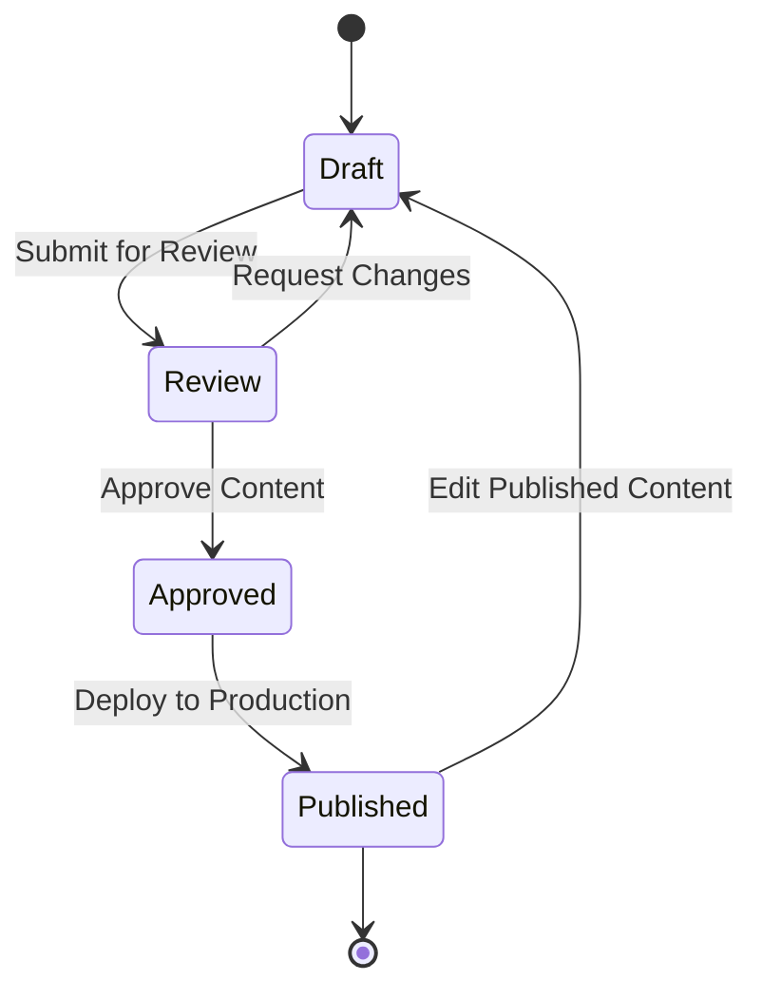

## 🖥️ Infrastructure Architecture

### Server Configuration

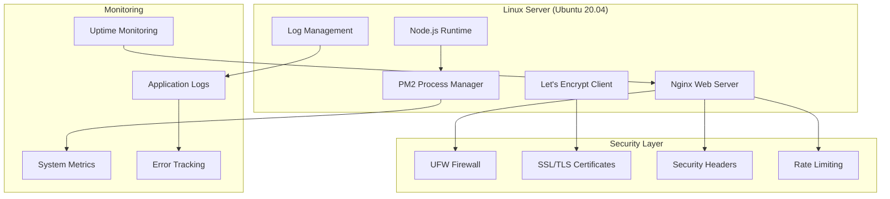

### Network Architecture

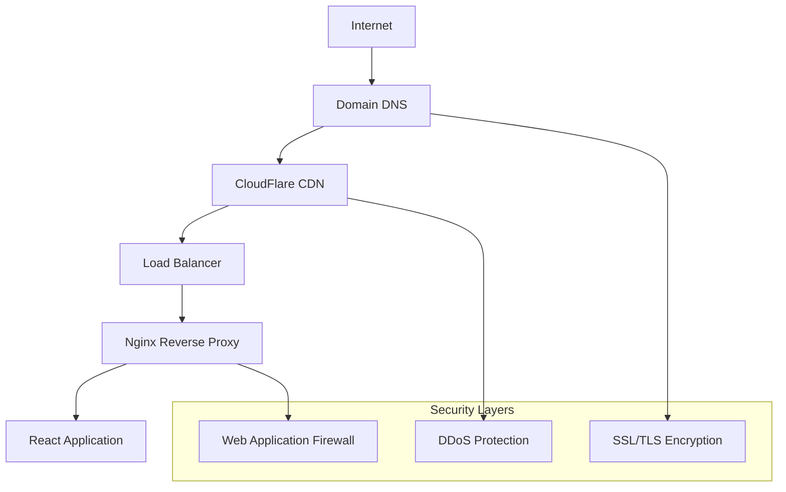

## 🚀 CI/CD Pipeline Architecture

### Deployment Pipeline

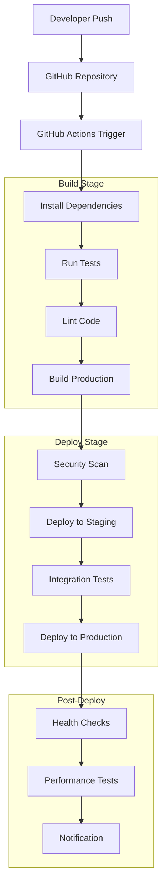

### Environment Management

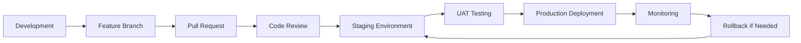

## 📧 Email Service Integration

### Email Architecture

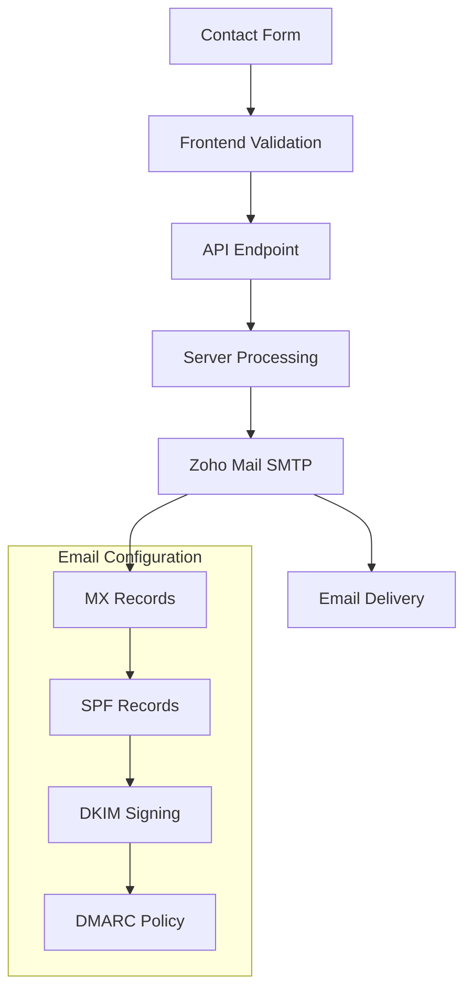

## 🔒 Security Architecture

### Security Layers

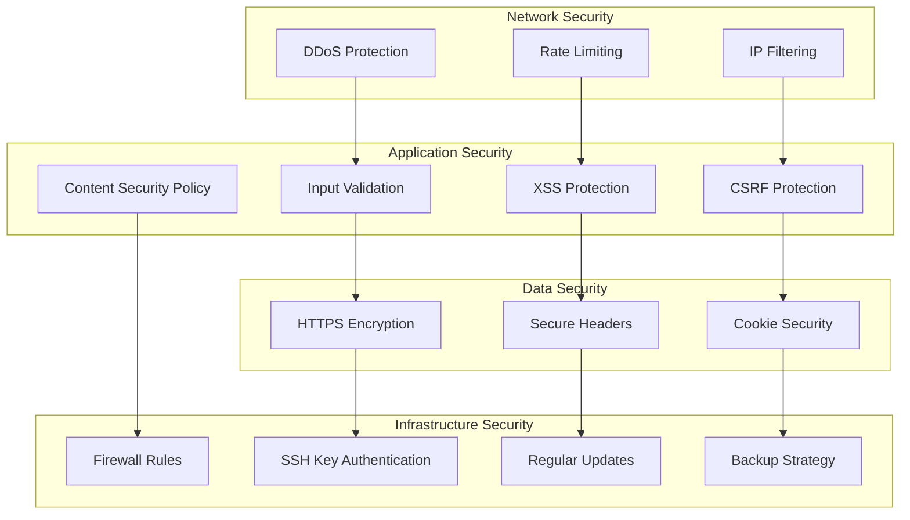

## 📊 Performance Optimization

### Caching Strategy

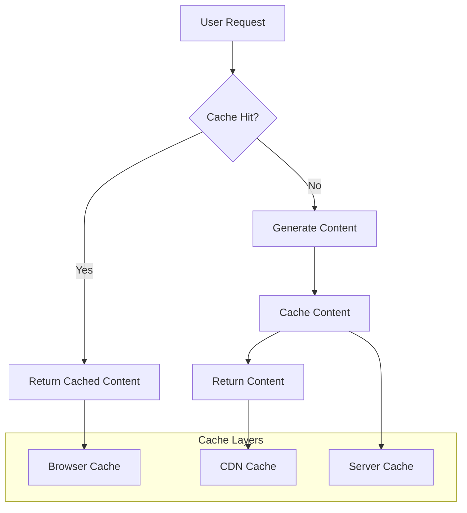

### Asset Optimization

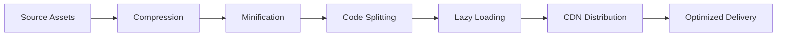

## 🎯 Scalability Considerations

### Horizontal Scaling

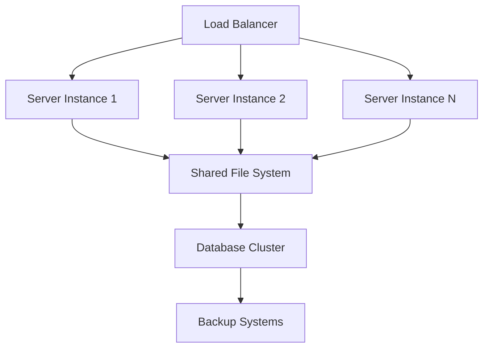

### Performance Monitoring

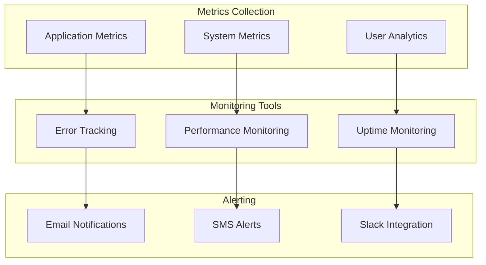

## 📱 Mobile Architecture

### Responsive Design Strategy

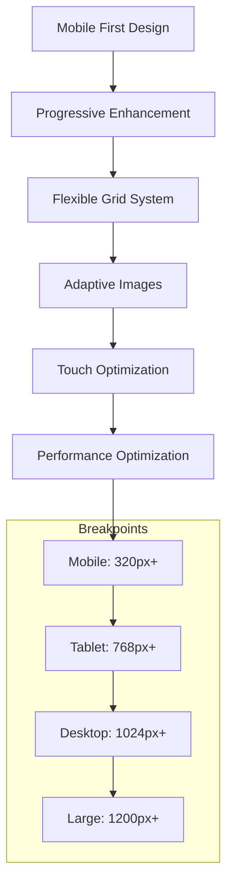

## 🔧 Development Environment

### Local Development Setup

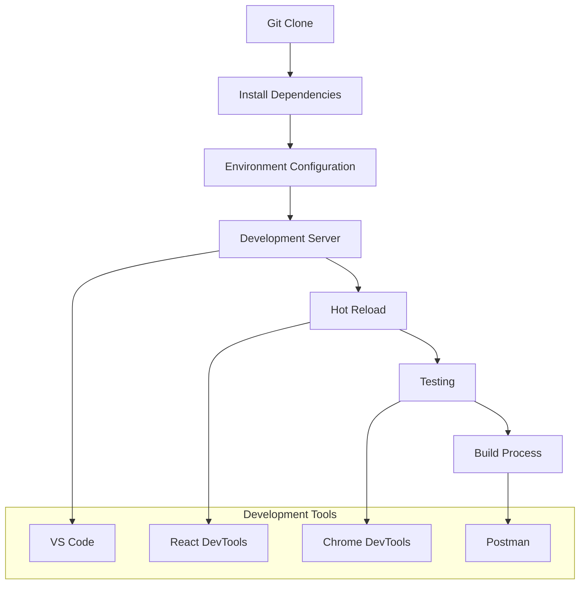

---

*This architecture documentation provides a comprehensive overview of the system design, infrastructure, and deployment strategies used in the enterprise website project. The modular approach ensures scalability, maintainability, and performance optimization.*